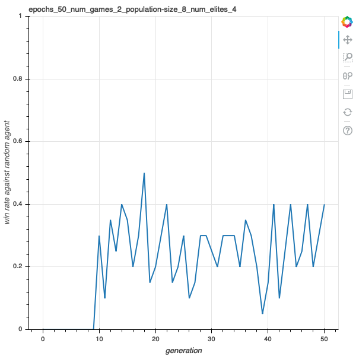
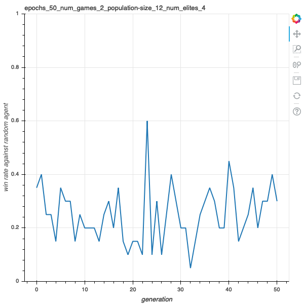
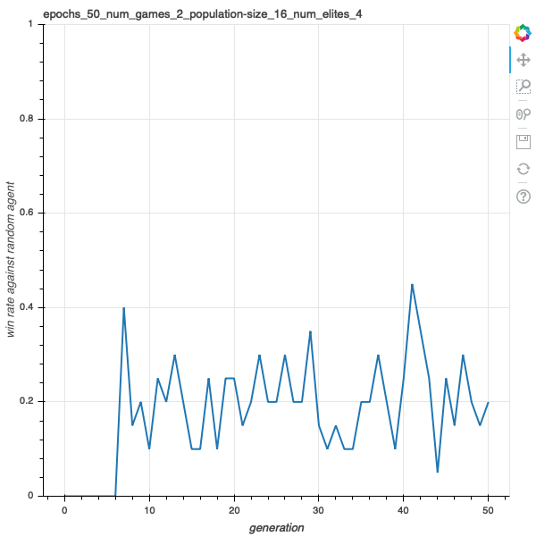
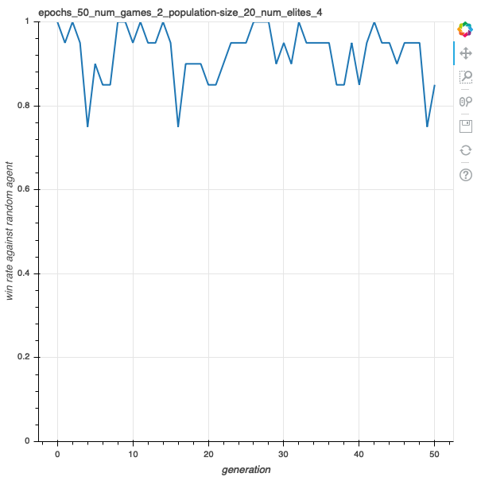
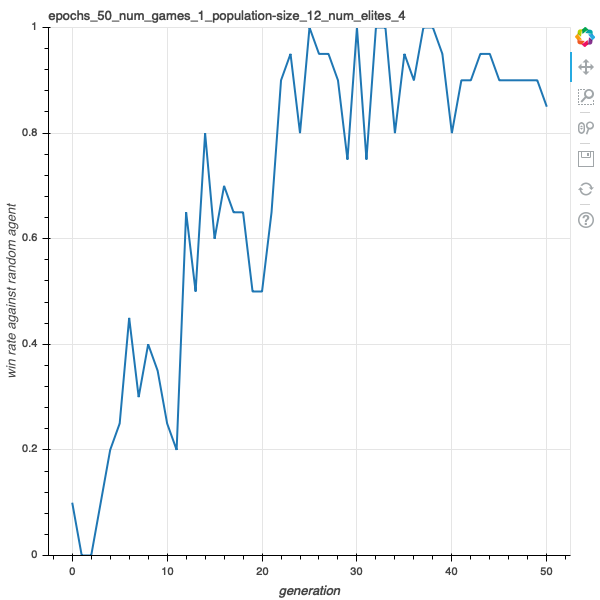
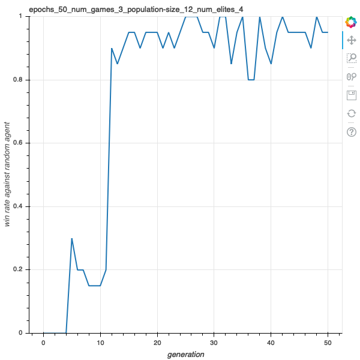
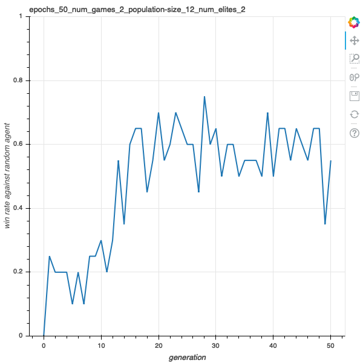
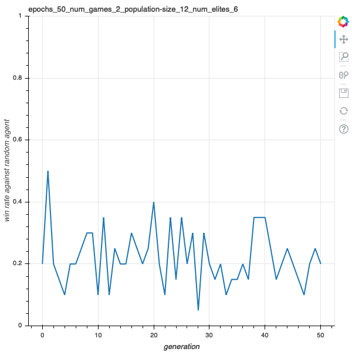

# CMPUT 659 Assignment 1 Report

[-> github](https://github.com/uduse/cmput-659-xai)

## The Domain Specific Language (DSL)
The provided DSL is very limited in flexibility and parsing string representation of a DSL is convoluted. As a result, I wrote my own version of the DSL.

### DSL Grammar
```python
grammar = {
    Rule.START: (
        Rule.BLOCK,
    ),
    Rule.BLOCK: (
        # this sampler allows repeating if blocks
        # the probability of the second if block appears is 0.6
        # the probability of the third if block appears is 0.6 * 0.6 = 0.36, etc.
        Diminishing(0.6, Rule.IF_BLOCK),
    ),
    Rule.IF_BLOCK: (
        [Rule.BOOL_EXP, Rule.IF_BODY],
    ),
    Rule.IF_BODY: [
        # This sampler allows weighted random choice
        # here, a return will be chosen 70% of the time,
        # while an extra block appears at 30% of the time
        Weighted({
            7: Rule.RETURN,
            3: [Rule.BLOCK, Rule.RETURN],
        })
    ],
    Rule.BOOL_EXP: [
        Rule.BOOL, 
        Rule.AND_EXP,
        Rule.NOT_EXP,
    ],
    Rule.AND_EXP: (
        [Rule.BOOL, Rule.BOOL],
    ),
    Rule.NOT_EXP: (
        Rule.BOOL,
    ),
    Rule.BOOL: (
        Rule.FUNC_CALL,
    ),
    Rule.FUNC_CALL: tuple(
        # here we parse all the library functions into rules
        make_dynamic_rule(name) for name in lib_func_names
    ),
    Rule.RETURN: (
        "return a",
    ),
    Rule.COLUMN_NUM: (
        '2', '3', '4', '5', '6'
    ),
    Rule.SMALL_NUM: (
        '0', '1', '2'
    )
}
```

### DSL Representation
The grammar defines the space of Abstract Syntax Tree (AST). 

Here's an example of an AST in the space.

```
Rule.START
+-- Rule.BLOCK
    +-- Rule.IF_BLOCK
        |-- Rule.BOOL_EXP
        |   +-- Rule.AND_EXP
        |       |-- Rule.BOOL
        |       |   +-- Rule.FUNC_CALL
        |       |       |-- Lib.progression_greater_than
        |       |       |-- state
        |       |       +-- Rule.SMALL_NUM
        |       |           +-- 0
        |       +-- Rule.BOOL
        |           +-- Rule.FUNC_CALL
        |               |-- Lib.is_doubles
        |               +-- a
        +-- Rule.IF_BODY
            +-- Rule.RETURN
                +-- return a
```

### Script Generation
A script is generated by rendering its corresponding AST. The process of sampling an AST from the grammar is stochastic, while rendering an AST to a script is deterministic.

Here's the script obtained by rendering the above AST:

```python
class Script_7534b62840e04041a875ae6799b31c31(Script):
    def get_action(self, state):
        actions = state.available_moves()
        for a in actions:
            if (not (Lib.progression_greater_than(self, "5f73ea86", state, 0))
                and (Lib.is_doubles(a))):
                return a
            pass
        return actions[0]
```

## My Script
I wrote my script in a way that the grammar can actually generates it.
I will describe my intentions with the comments inside of the code:

```python
class MyScript(Script):
    def get_action(self, state):
        actions = state.available_moves()
        for a in actions:
            # I want to first differentiate between 'yes' and 'no' actions
            if (Lib.is_no_action(self, "", a)):
                # If it's a 'no', then we select it when we finished a column this round
                if (Lib.has_won_column(self, "", state, a)):
                    return a
                
            if (Lib.is_yes_action(self, "", a)):
                # if it's a 'yes', then we select it when we made too little progress this game
                if (not Lib.progression_greater_than(self, "", state, 2)
                   and not Lib.has_won_column(self, "", state, a)):
                    return a
                # or if we made too little progress this round
                if (not (Lib.progression_this_round_greater_than(self, "", state, 1))):
                    return a

            # we prioritize actions that win a column for us
            if (Lib.action_wins_column(self, "", state, a)):
                return a
                
            # also always choose a double if we have a chance
            if (Lib.is_doubles(self, "", a)):
                return a
               
        return actions[0]
```

This script has a win rate of 0.93 against the random agent, which I think is pretty good.
I also evaluated this script against the best script generated by the genetic algorithm,
and it still has a win rate of 0.45, which is still decent.

## Redundancy Removal
My grammar supports `not` and `and` operation and that makes function calls that always returns `False` still meaningful. This means any function that has been called at least once during the evaluation is meaningful to the script. To move redundancy in the scripts, first we need to record what functions are actually called. 

I achieved this by these following steps:

#### 1. bind functions to AST nodes
By binding functions to their corresponding AST nodes, we are able to map script content back to specific nodes in the AST. This is done by assigning ID to AST nodes, and have all functions rendered in a way that incorporates the ID. For example, in the above script, we have a function like:

```python
Lib.action_wins_column(self, "5f73ea86", state, a)
```

The second argument `"5f73ea86"` is the ID of the corresponding node in the AST.
Once this function is called, it will have a side effect of adding itself to the `set` of all IDs of called functions, stored in `self.call_log`.
In other words, once the above function is called, `self.call_log` will contain `"5f73ea86"` which means the node `"5f73ea86"` is marked as "called".

Now, we can remove unused function calls by pruning the AST based on the `call_log`.
However, this requires some fixing to the AST as simply taking away functions that are not called could break the validity of the AST.

For example, in `func1() and func2()`, if `func1()` always returns `True`, `func2` will never be called.
If we want to remove `func2()`, we would need to change the AST so `func1()` is no longer a part of a `Rule.AND` . There are many other ways that removing a function call would break the AST.

As a result, we want to remove in-effective blocks instead, since blocks can be removed without breaking the AST.

#### 2. bubble up marks
How do we decide what block is effective? We say that a block is effective when at least one of its children is effective.
Therefore, we want to update the `call_log` so it includes all nodes that have at least one marked child.
We achieve this by bubbling the marks for all nodes in the `call_log`.

For example, if we have an AST with marked nodes denoted as `X`:

```
O
+-- O
    +-- X
    +-- O
```

We bubble up the marks and now it will look like this:

```
X
+-- X
    +-- X
    +-- O
```

#### 3. remove nodes in the AST
Now we know that all nodes that are not marked have no impact during the evaluation.
We remove all these nodes. In the case of the tree above, we will have:

```
X
+-- X
    +-- X
```

If we removed any of the nodes, the script has to be re-rendered based on the new AST.


## Genetic Algorithm

### Mutation
Since I render scripts based on ASTs, mutations can be managed in a more fine-grained way by replacing subtrees.
This means mutations can happen in any level of the grammar, from replacing the whole script to changing a specific parameter in a function call.

To mutate a script, we first first choose a node randomly from its AST.
Then, that node is removed from the AST and a new subtree is built base on the type of the removed node using the same grammar.

### Crossover
To crossover to script, we first randomly choose one `Rule.IF_BLOCK` from both of them as subtree heads.
Then, we swap the subtrees of these two ASTs and render new scripts based on the new ASTs.

## Results
I would like to see how these factors in my genetic algorithm affects the result:

 - population size
 - number of games for evaluation
 - number of elites to keep for each generation
 
I will do this comparison by keeping the other parameters the same while adjusting the target parameter.
 
 
### Population Size
 
#### population size = 8


#### population size = 12


#### population size =  16


#### population size = 20


As we can see, larger population increases the population overall win rate of the scripts.

### Number of Games Played for Evaluation

I guessed the more games are played for evaluation, the more accurate the evaluation would be.
As a result, stronger scripts are more likely to be kept.

#### number of games = 1


#### number of games = 2


#### number of games = 3


It seems that the number of games played has no direct impact on the quality of the scripts generated.

### Number of Elites to Keep

#### number of elites = 2


#### number of elites = 4


#### number of elites = 6


Aa we can see, having more elites negatively impacts the quality of the scripts generated.
My guess is that too many elites limits the potential space for mutation and crossover, so better scripts are less likely to emerge.

## Discussion

### thoughts on generating scripts with genetic algorithm

I felt that generating scripts with genetic algorithm and training neural networks are alike.
Neural network training techniques are sometimes referred as "alchemy" or "black magic".
This is because taking an action, like changing a parameter, leads to undefined behavior.
Though this undefined behavior is somehow correlated to the action, one may only make guesses based on their experience and common practices.
When one's goal is to improve a specific metric while influences of different approaches are not obvious, one may only make best guesses and do experiments with trials and errors. For this specific assignment, I spent a lot of time experimenting with different things but still unaware of their real impact on the result.

The things I tried include:

* add more library functions for scripts to utilize
* use more expressive grammar to allow advanced scripts
* limit mutation rate to allow keeping of good scripts
* limit crossover subtree size to disable huge replacements

I failed to isolate variables in experiments and confidently tell the influence of a specific change to the algorithm.
This is mainly due to the randomness in generating scripts combined with the time cost of doing experiments.
If the outcomes are more arbitrary, then we need to do more experiments to be confident.
However, the time cost of doing less arbitrary experiments is higher (e.g, using a larger population size, using more epochs, playing more games during evaluation), and this conundrum cannot be avoided easily.
Consequently, the plots I displayed in the "Results" section are not as convincing since too little experiments were ran for it.

Maybe hyper-parameter tuning would reduce this problem of adjusting parameters headlessly, but that requires even more computations. 

### comparison between my script and the genetically evolved script

I discovered that function `has_won_column` used together with `is_no_action` significant improves a script's performance.
Even without other clauses these two functions can produce a script that beats an random agent 90% of the time.
It's not surprising that almost all of the scripts 

### is the smaller version of Can't stop an interesting game?
Not really.
First of all, the game is too simple.
There aren't many decisions you can make during a game.
In addition, some rules are way superior to others, making the genetic algorithm all about find these superior rules.
Secondly, there are too little interactions between players.
The only thing that matters is the control of a specific column.
Other than that, the script just do its own things.

### scripts for the commercial version of Can't stop
My scripts showed there are only a few things you have to think to play well, and other observations are not very important.
This means the game can be boring once all the players know to stop when they take control over a column, and the rest are largely decided by luck.
Heavily luck dependent games are not welcomed unless real in-game currency is involved (i.e. unless it's gambling).
So I would vote against the development of a commercial version of the game since either it will be boring or it will involve gambling.

